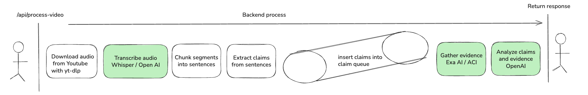

# YouTube Fact-Checker

Real-time fact-checking for YouTube videos using AI.

## Architecture

- **Chrome Extension** - Frontend overlay on YouTube videos
- **FastAPI Backend** - Processing pipeline with async queues
- **AI Services** - Whisper, RunPod Deep Cogito v2 70B, ACI, OpenAI



## Backend Setup

### 1. Install Dependencies
```bash
cd backend
pip install -r requirements.txt
```

### 2. Environment Variables
```bash
# Copy the example file
cp env.example .env

# Edit .env with your API keys:
# OPENAI_API_KEY=sk-your-openai-api-key-here
# RUNPOD_API_KEY=your-runpod-api-key-here  
# ACI_API_KEY=your-aci-api-key-here
```

### 3. Install System Dependencies
```bash
# Install FFmpeg (required for yt-dlp audio processing)
brew install ffmpeg  # macOS
# sudo apt install ffmpeg  # Ubuntu/Debian
```

### 4. Run the Server
```bash
cd backend
uvicorn main:app --reload --host 0.0.0.0 --port 8000
```

### 5. Test the API
```bash
# Health check
curl http://localhost:8000/health

# Process a video
curl "http://localhost:8000/api/process-video?video_url=https://www.youtube.com/watch?v=jNQXAC9IVRw"
```

## API Endpoints

- `GET /health` - Health check
- `GET /api/process-video?video_url=URL` - Process YouTube video for fact-checking

### Request Format
```
GET /api/process-video?video_url=https://youtube.com/watch?v=VIDEO_ID
```

### Response Format
```json
{
  "video_id": "VIDEO_ID",
  "title": "Processed Video",
  "total_claims": 1,
  "claim_responses": [
    {
      "claim": {
        "start": 0.0,
        "claim": "factual claim text"
      },
      "status": "verified|false|disputed|inconclusive",
      "written_summary": "Detailed explanation of fact-check result...",
      "evidence": [
        {
          "source_url": "https://example.com",
          "source_title": "Source Title",
          "snippet": "Evidence excerpt..."
        }
      ]
    }
  ]
}
```

## Frontend Setup
We created interfaces.

### Interface 1: Chrome extension v1 (demoed)
Once you have the backend app running, you'll need to unpack the Chrome extension

1. Go to Chrome, navigate the manu towards `Extensions` and then `Manage Extensions`
2. Switch on the `Developer mode` toggle
3. Click on `Load unpacked` and unpack the chrome-extension in the frontend project directory: `Stockholm-Hackathon/frontend/public/chrome-extension`
4. You'll then see `YouTube Fact-Checker` extension. Re-open your browser.
5. Go to Youtube, play a video, then click on the liquid-glass circle in the upper-right corner to activate fact checking


### Interface 2: Chrome extension v2
Once you have the backend app running, you'll need to unpack the Chrome extension

1. Go to Chrome, navigate the manu towards `Extensions` and then `Manage Extensions`
2. Switch on the `Developer mode` toggle
3. Click on `Load unpacked` and unpack the chrome-extension in the frontend project directory: `Stockholm-Hackathon/yt-fact-checker-extension`
4. You'll then see `YouTube Fact-Checker (Live)` extension. Re-open your browser.
5. Go to Youtube, play a video, the fact-checker pop-up will be immediately available. Note that it takes a few seconds to start transcribing


### Interface 3: Lovable dashboard


## Processing Pipeline

1. **Transcription** - Download audio with yt-dlp → OpenAI Whisper API → Sentences with timestamps
2. **Claim Extraction** - RunPod Deep Cogito v2 70B → Extract factual claims
3. **Evidence Gathering** - ACI + EXA_AI → Find web sources and evidence
4. **Fact-Checking** - OpenAI GPT-4 → Analyze evidence → Return verdict

## Tech Stack

- **FastAPI** - Async web framework
- **OpenAI Whisper** - Audio transcription with timestamps
- **RunPod Deep Cogito v2 70B** - Advanced claim extraction
- **ACI + EXA_AI** - Evidence gathering and web search
- **OpenAI GPT-4** - Fact-checking analysis
- **yt-dlp** - YouTube audio download
- **Pydantic** - Data validation and structured outputs

## Development

The backend uses async queues for concurrent processing:
- Sentences are streamed from transcription
- Claims are extracted in real-time
- Fact-checking happens concurrently
- Results are returned as structured JSON

Perfect for hackathon development with clean separation of concerns and production-ready architecture.


$env:PATH += ';C:\ffmpeg\bin' 
cd .\backend\  
.\venv\Scripts\activate 
python -m uvicorn main:app --reload --host 0.0.0.0 --port 8000